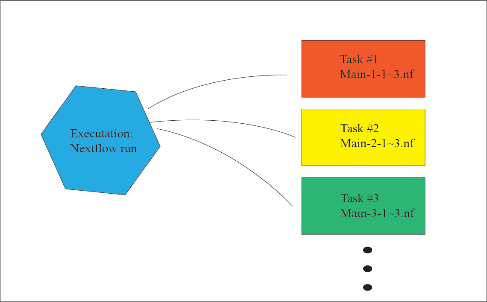

# FastQC-nf bioinformatics workflow

 - [Description](#description)
 - [User Guide](#user-guide)
 - [Additional notes](#additional-notes)
 - [Acknowledgements](#acknowledgements)

## Description

<p align="center">
:wrench: This pipeline is currently under development :wrench:
</p>

FastQC-nf is a Nextflow workflow for evaluating the quality of high-throughput sequencing reads. It employs [FastQC](https://www.bioinformatics.babraham.ac.uk/projects/fastqc/) to assess the quality of individual fastq files. FastQC metrics are then aggregated into a single HTML report using [MultiQC](https://multiqc.info/). This pipeline accepts both Illumina short read and PacBio long read datasets. 

## Diagram 


## User guide

### 0_Data
The test data is download from [bio-test-datasets](https://github.com/Sydney-Informatics-Hub/bio-test-datasets/tree/main#bio-test-datasets), which contains Paired-end Platinum Genomes fastq files for NA12877 subset to 10k reads. 

### 1_Set up

 ```
 git clone https://github.com/Sydney-Informatics-Hub/fastqc-nf.git
```

### 2_Run:

#### task_1_hello_world

##### main-1-1.nf

```
 nextflow run ./task/main-1-1.nf
 ```
##### main-1-2.nf

```
 nextflow run -e.mode=ciao ./task/main-1-2.nf
```
##### main-1-3.nf

```
 nextflow run ./task/main-1-3.nf
```

#### task_2_fastq_1

main-2-1.nf

```
 nextflow run ./task/main-2-1.nf --fq ./data/NA12877_R1_10k.fq.gz --output results
```

## Acknowledgements
The authors acknowledge the technical assistance provided by the Sydney Informatics Hub (SIH), a Core Research Facility of the University of Sydney and the Australian BioCommons.